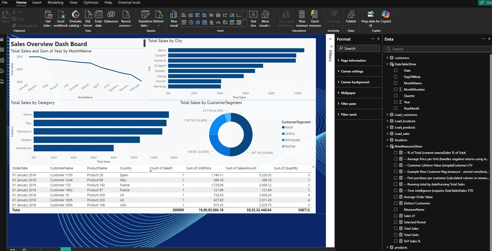

# Power BI Customer Sales Analysis

Contents:
- sales.csv (sample sales transactions, ~200k rows)
- customers.csv (10k rows)
- products.csv (500 rows)
- locations.csv (200 rows)
- DAX_measures.txt (useful DAX measures for the model)
- Load_*.pq (Power Query / M snippets for loading CSVs)
- powerbi_theme.json (Power BI JSON theme - import in View > Themes > Browse for themes)
- relationships_diagram.png (visual diagram of recommended relationships)
- README.md (this file)

# How to use
1. Open Power BI Desktop.
2. Get Data > Text/CSV > select each CSV (or place all CSVs in one folder and use Folder connector).
3. For each table, use the provided Load_*.pq snippet as a reference (Advanced Editor) to ensure correct data types.
4. Create a proper Date table (DateTable) with contiguous dates from min(OrderDate) to max(OrderDate).
   Example Date table can be created in Power Query or DAX. Make sure to mark it as 'Date Table' in Model view.
5. In Model view, create these relationships (see relationships_diagram.png):
   - sales[CustomerID] (many) --> customers[CustomerID] (one)  (Single, Cross filter: Both or Single depending on need)
   - sales[ProductID] (many) --> products[ProductID] (one)
   - sales[LocationID] (many) --> locations[LocationID] (one)
   - sales[OrderDate] (many) --> DateTable[Date] (one)
6. Paste measures from DAX_measures.txt into a Measures table or into appropriate tables.
7. Import the theme: View -> Themes -> Browse for powerbi_theme.json
8. Build visuals using fields and measures. Use slicers for DateTable[Year], DateTable[Month], locations[Region], products[Category], customers[CustomerSegment].

# Relationships
- Star schema: central fact table (sales) with dimension tables (customers, products, locations, DateTable).
- Cardinality: Fact (many) -> Dimension (one). Use single-directional cross-filter from dimensions to facts for performance, change to Both only when you need filtering from fact to dim.
- Keys: Use surrogate integer keys where possible and ensure uniqueness on 'one' side.
- Avoid bi-directional filters unless required; they can create ambiguous relationships and slow models.
- Use relationships rather than merging tables when you want to keep grain of data and avoid duplication.

# Limitations
- This package includes sample data and M/DAX snippets.
- The sales.csv is intentionally 'large' (~200k rows) to simulate performance considerations; in real world you may use DirectQuery or Aggregations for millions of rows.
  
## 📊 Dashboard Output Preview

  

## Author: Shine Jose — M.Sc. Informatik (Data Science)
